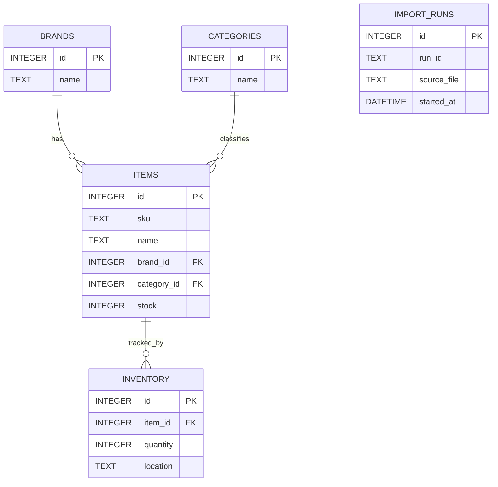

```mermaid
erDiagram
    BRANDS {
        INTEGER id PK
        TEXT name
    }
    CATEGORIES {
        INTEGER id PK
        TEXT name
    }
    ITEMS {
        INTEGER id PK
        TEXT sku
        TEXT name
        INTEGER brand_id FK
        INTEGER category_id FK
        INTEGER stock
    }
    INVENTORY {
        INTEGER id PK
        INTEGER item_id FK
        INTEGER quantity
        TEXT location
    }
    IMPORT_RUNS {
        INTEGER id PK
        TEXT run_id
        TEXT source_file
        DATETIME started_at
    }

    BRANDS ||--o{ ITEMS : has
    CATEGORIES ||--o{ ITEMS : classifies
    ITEMS ||--o{ INVENTORY : tracked_by
```
